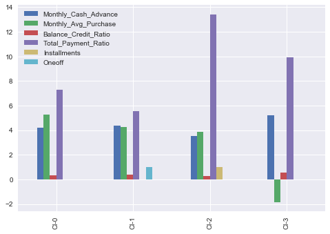

# Credit Card Customer Segmentation

--------------------------------------------------------------------------------

**Business Context:** This case requires to develop a customer segmentation to define marketing strategy. The dataset has about 9000 credit card holders information for last 6 months. This project was done as a part of DataScience with Machine Learning Course from [AnalytixLabs](https://www.analytixlabs.co.in/data-science-using-python)

## Project Summary
* Derived new KPI by using data manipulation methods.
* Checked the multi-collinearity using heatmap.
* Standardized the data and applyied PCA to get optimal number of Pricipal Components.
* KMeans Clustering is used - Silhotte Score and Cluster Inertia Score used to fix the number of clusters.
* Done profiling to draw insights for the clusters.

## Final Clusters and Recommendations
* Based on silhouette_score, i have taken number of clusters to be 4.

* **Suggested Marketing Strategy for these clusters:**
* Group 0
   - This is performing best among all the clusters are maintaining highest monthly average purchases. Giving any reward points might increase their purchases.
* Group 1
   - This group is doing maximum oneoff payments(may be for bills only). Customers of this group can be offered discount/offer on next transactions upon full payment.  
* Group 2 
   - They are potential target customers who are paying bills and doing purchases and maintaining comparatively good credit score. So we can increase credit limit or can lower down interest rate. Promote premium cards/loyality cars to increase transcations.  
* Group 3
   - These customers are taking maximum cash advance, these customers should be given remainders for payments. Offers can be provided on early payments to improve their payment rate.

## Installation
The Installation process will get you a copy of the project up and running on your local machine for development and testing purposes
1. Clone or download the project into your local machine.
2. Unzip the project folder.
3. Open the source file [CreditCard-Segmentation-Solution](CreditCard-Segmentation-Solution.ipynb) using [JypyterNotebook](http://jupyter.org/) and execute the file.

## Prerequisites
The following list summarizes the packages/softwares used in this project. These are the softwares/packages you neeed to install before executing the project file.
* Anaconda v – 5.2.0 (py 36_3) 
* Python v – 3.6 + 

## License 
The enitre contents of the repository are Licensed under the [Apache License 2.0](LICENSE)

## Trademarks
All other trademarks referenced herein are the property of their respective owners.
