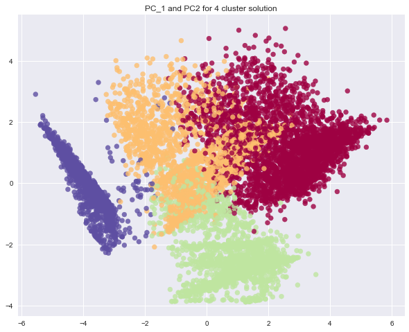
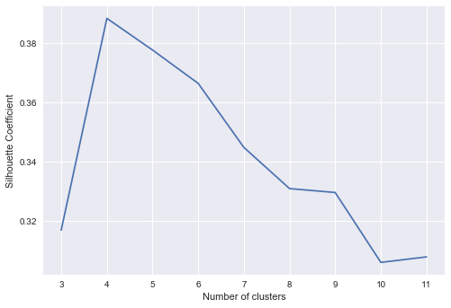

# Credit Card Customer Segmentation

--------------------------------------------------------------------------------

**Business Context:** This case requires to develop a customer segmentation to define marketing strategy. The dataset has about 9000 credit card holders information for last 6 months.

## Project Summary
* Derived new KPI by using data manipulation methods.
* Checked the multi-collinearity using heatmap.
* Standardized the data and applyied PCA to get optimal number of Pricipal Components.
* KMeans Clustering is used - Silhotte Score and Cluster Inertia Score used to fix the number of clusters.
* Done profiling to draw insights for the clusters.

## Final Clusters and Recommendations

## Installation
The Installation process will get you a copy of the project up and running on your local machine for development and testing purposes
1. Clone or download the project into your local machine.
2. Unzip the project folder.
3. Open the source file [CreditCard-Segmentation-Solution](CreditCard-Segmentation-Solution.ipynb) using [JypyterNotebook](http://jupyter.org/) and execute the file.

## Prerequisites
The following list summarizes the packages/softwares used in this project. These are the softwares/packages you neeed to install before executing the project file.
* Anaconda v – 5.2.0 (py 36_3) 
* Python v – 3.6 + 

